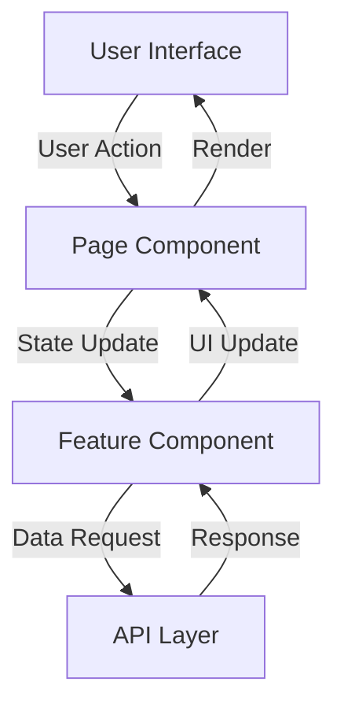

# Architecture Overview

## Project Structure

equity-automator/
├── src/
│   ├── app/                    # Next.js app directory
│   │   ├── dashboard/         # Dashboard pages
│   │   │   ├── page.tsx       # Main dashboard
│   │   │   ├── layout.tsx     # Dashboard layout
│   │   │   ├── workforce/     # Workforce management
│   │   │   ├── reports/       # Reports generation
│   │   │   ├── analytics/     # Analytics dashboard
│   │   │   └── settings/      # Settings pages
│   │   └── layout.tsx         # Root layout
│   ├── components/            # React components
│   │   ├── ui/               # Reusable UI components
│   │   │   ├── button.tsx
│   │   │   ├── card.tsx
│   │   │   ├── data-table.tsx
│   │   │   └── ...
│   │   └── shared/           # Shared components
│   ├── lib/                  # Utilities and helpers
│   ├── styles/               # Global styles
│   └── types/                # TypeScript types
├── public/                   # Static assets
└── docs/                     # Documentation

## Core Patterns

### 1. Component Architecture

We follow a component-based architecture with these categories:

- **Page Components**: Full pages in the app directory
- **Layout Components**: Structural components for layouts
- **UI Components**: Reusable UI elements
- **Feature Components**: Specific feature implementations
- **Composite Components**: Combinations of UI components

### 2. State Management

- Local state using React hooks
- Form state using react-hook-form
- Server state will be managed with React Query (planned)

### 3. Styling Approach

- Tailwind CSS for utility-first styling
- CSS Modules for component-specific styles
- CSS Variables for theming
- Responsive design using Tailwind breakpoints

### 4. Data Flow



### 5. Component Patterns

#### Page Pattern

```typescript
export default function FeaturePage() {
  return (
    <div className="space-y-8 p-8">
      {/* Page Header */}
      <PageHeader title="Feature" description="Feature description" />
      
      {/* Main Content */}
      <MainContent />
      
      {/* Additional Sections */}
      <Section />
    </div>
  )
}
```

#### Component Pattern

```typescript
interface ComponentProps {
  // Props definition
}

export function Component({ ...props }: ComponentProps) {
  // Component logic
  return (
    <div>
      {/* Component content */}
    </div>
  )
}
```

### 6. Navigation Structure

- Dashboard layout with sidebar navigation
- Nested routing for feature sections
- Modal-based navigation for quick actions
- Breadcrumb navigation for deep pages

### 7. Theme System

```css
:root {
  /* Brand Colors */
  --brand-primary: 221.2 83.2% 53.3%;
  --brand-secondary: 215 25% 27%;
  
  /* Semantic Colors */
  --success: 142.1 76.2% 36.3%;
  --warning: 38 92% 50%;
  --error: 0 84.2% 60.2%;
  
  /* Other theme variables */
}
```

## Implementation Status

### Completed Features

- Dashboard layout and navigation
- Core UI components library
- Theme system implementation
- Basic page structures
- Data display components

### In Progress

- Interactive features
- Form implementations
- Data management
- API integration planning

### Planned

- Authentication system
- Advanced analytics
- Report generation
- Data visualization

## Development Guidelines

1. **Component Creation**
   - Use TypeScript for all components
   - Include prop types and documentation
   - Follow the established patterns

2. **Styling**
   - Use Tailwind utilities when possible
   - Follow the design system tokens
   - Maintain responsive design

3. **State Management**
   - Keep state close to where it's used
   - Use composition for complex state
   - Plan for server state integration

4. **Performance**
   - Implement code splitting
   - Optimize component re-renders
   - Use proper loading states

## Quick Reference

### Common Imports

```typescript
import { Button } from "@/components/ui/button"
import { Card } from "@/components/ui/card"
import { DataTable } from "@/components/ui/data-table"
```

### Utility Functions

```typescript
import { cn } from "@/lib/utils"
```

### Theme Classes

```typescript
const commonClasses = "space-y-8 p-8"
const cardClasses = "rounded-lg border bg-card p-6"
```

## Next Steps

1. Review the [Component Documentation](../components/ui-components.md)
2. Check the [Development Roadmap](../development/roadmap.md)
3. Follow the [Contributing Guidelines](../development/contributing.md)
